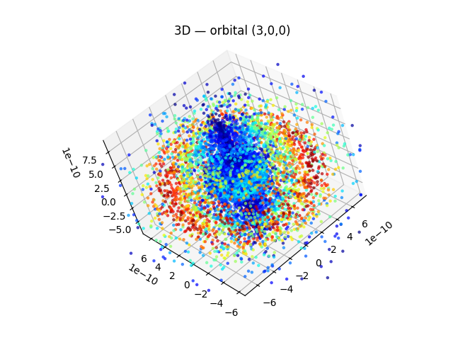
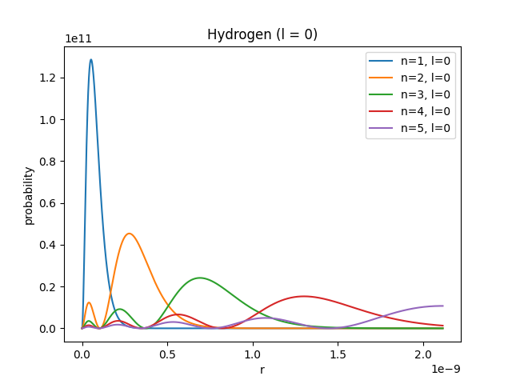
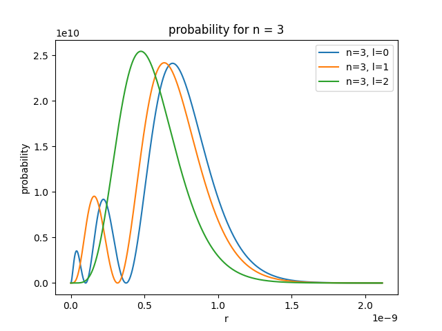

# Hydrogen Atom Quantum simulation
> Welcome to my Hydrogen atom simulation ! This project visualizes both the 2D cross-section and the 3D spatial distribution of an electron around a fixed proton.
> here is an example of a 3D monte-carlo scatter :

  
<\p>

# Graphs of radial probability function
> These images shows the radial probability, the first one show the difference between different energy levels where l = 0.
> And the second one shows the difference between different azimuthal/magnectic quantum numbers with n = 3.

  
  

 

# 2D Cross-sections
> Some examples of 2D cross-section :

n = 2

  
  
  

 

n = 3

  
  
  
  
  

 

n = 4

  
  
  
  
  
  
  

 

